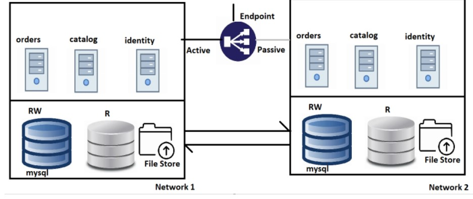
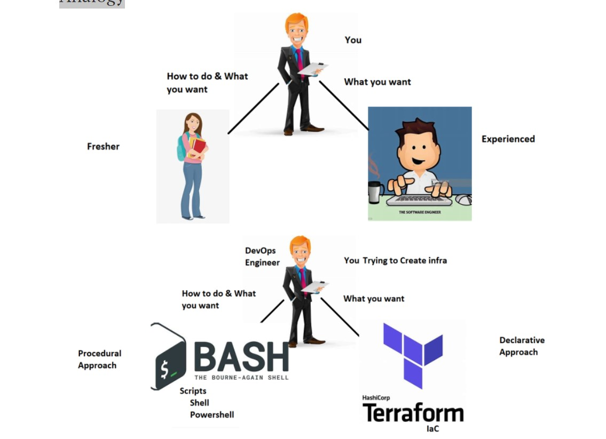
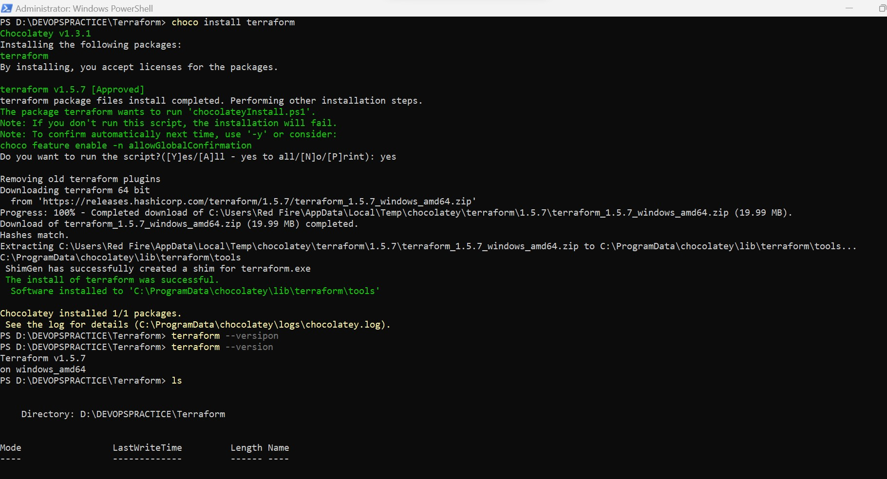
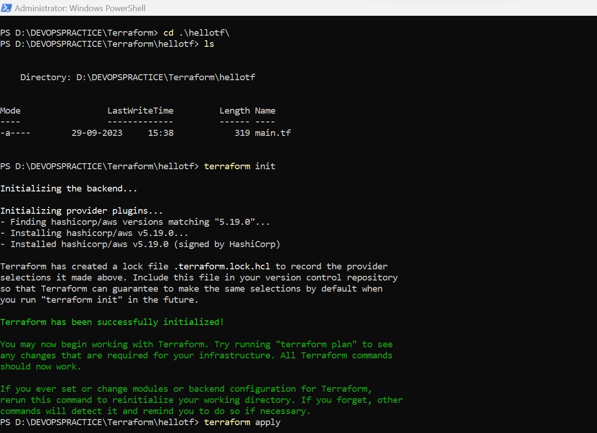
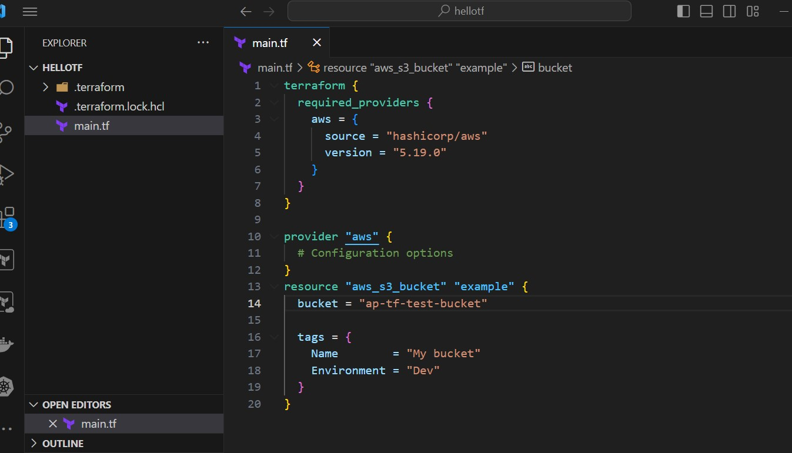

#### Terraform

###### DAY 1
* To preview README.md ctrl+shift+v
* 
## Problem Statement
* Our ficticious Organization:
    * name: Asquare info systems
    * Product: iEcommerce
    * Purpose: Any Organization can buy this project and host ecommerce  applications 
* This product is designed to work on any virtualized platform such as
    * VMWare
    * OpenStack
    * AWS
    * Azure
    * GCP
* Now Asquare info systems needs to have an apporach to deploy 
  the iEcommerce applicatio into Customers Cloud/Virtual Environments
* Architecture of iECommerce

### Infra for iECommerce
* Two networks with connectivity b/w them 
  (same building, different    buildings, cities, countries)
* In Each network
* Two Databases
    * mysql
    * RAM: 8 GB
    * cpus: 2
    * Disk: 10 TB
  
    * one File Store
    * Size: 10 TB
  
    * 3 Servers:
    * OS: Ubuntu 22.04
    * RAM: 16 GB
    * Cpus: 2
    * Disk: 50 GB
* Solution:
* InfraProvisioning: This represents using Infrastructure as a Code
  and deploy to target environment
### Understanding InfraProvisioning
 * Analogy
  
* We using InfraProvisioing tools where we express our desired state 
  about  infrastructure as code.
* Terraform: Can create infra in almost all the virtual environments
* ARM Templates: Can create infra in Azure
* Cloudformation: Can create infra in AWS
* Infraprovisiong tools use IaC which are generally idempotent
* Idempotance is the property which states execution one time
  or multiple times leads to the same result.
* Reusability is extreemely simple and terraform can also handle
  multiple environments (Developer, QA, UAT/Staging/Production).

  ###### DAY 2

* ### Terraform 
  
* Terraform is an opensource tool developed by HashiCorp which can 
  create infra in almost any virtual platform
* Terraform uses a language which is called as 
  `Hashicorp Configuration   Language (HCL)` to express desired State.

## Terms

* Resource: This is the infrastructure which you want to create
* Provider: This refers to where you want to create infrastructure
* The inputs which we express in teraform are called as `arguments`
* The output given by terraform is referred as `attribute`
  
  ## Installing terraform
 
* Refer Here @https://developer.hashicorp.com/terraform/downloads 
* We have executed the commands in following order
  
  
  

